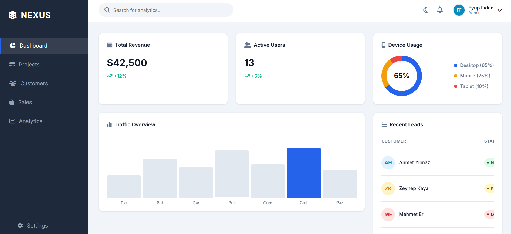
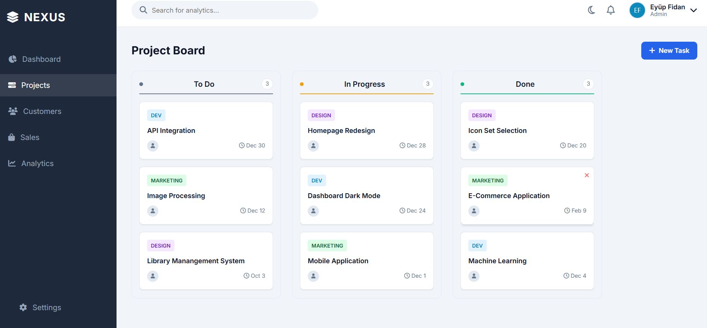
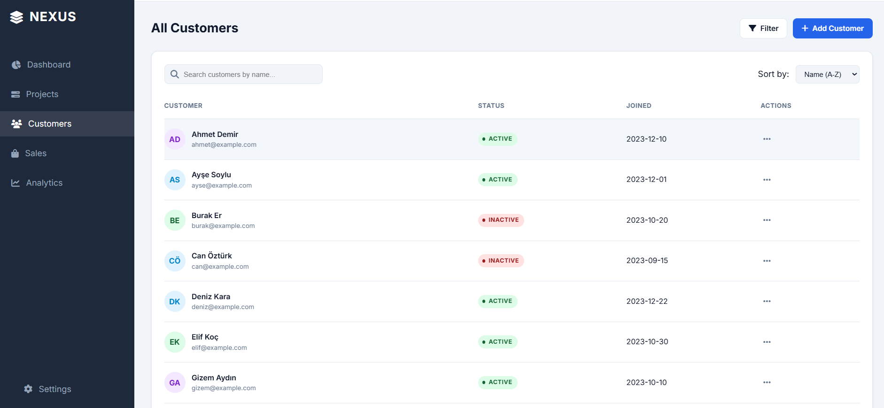
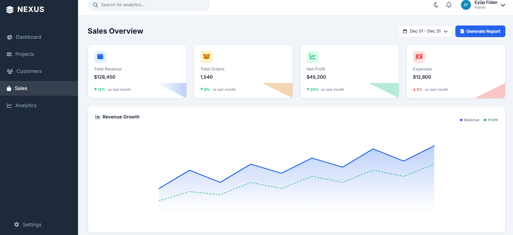
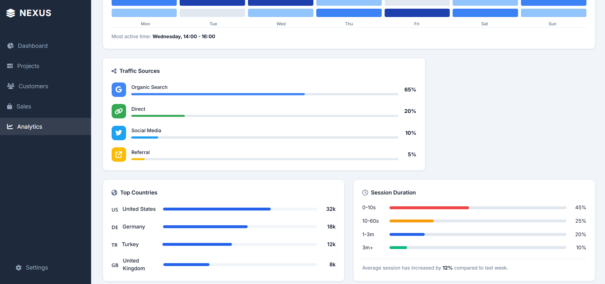
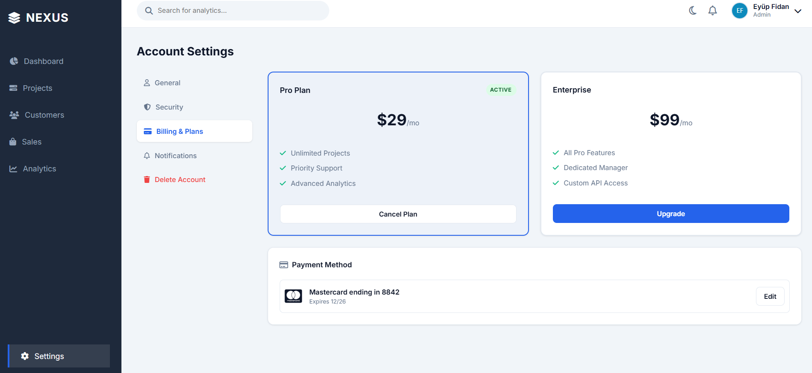
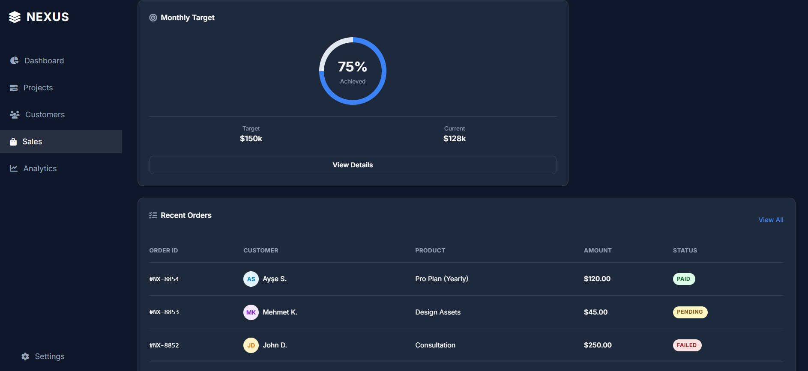
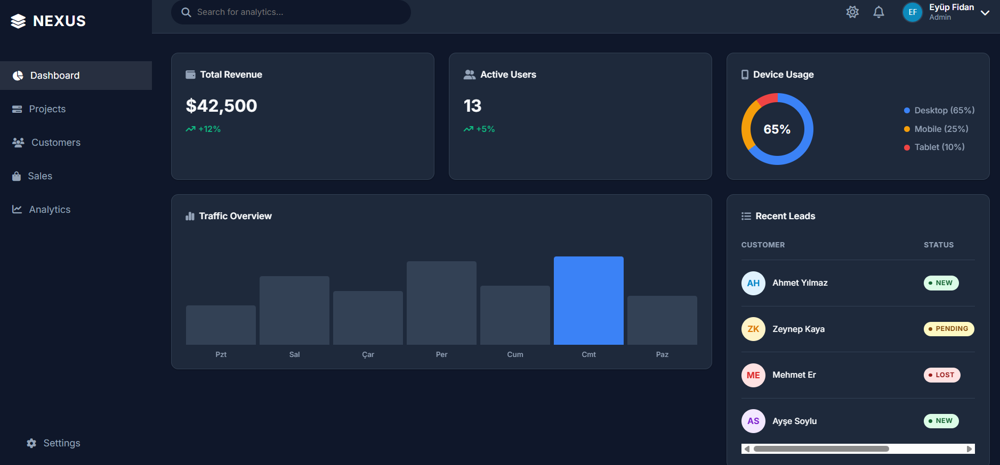
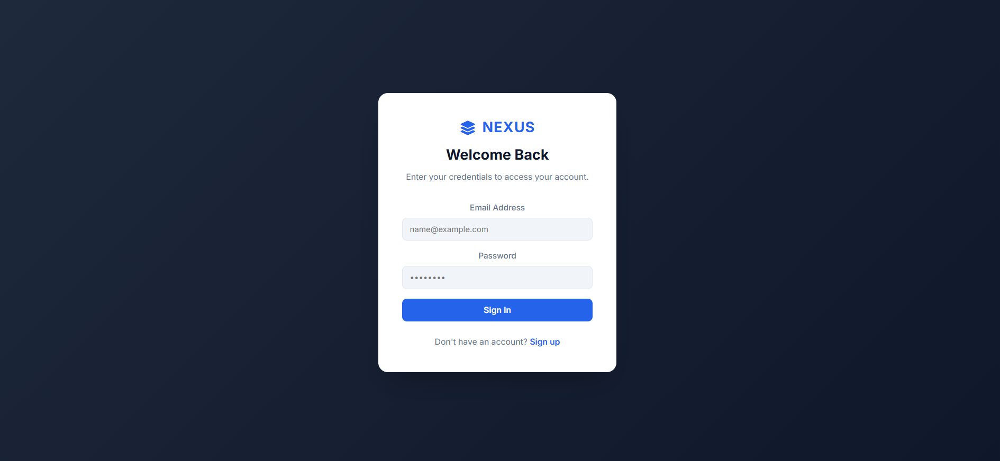

# 🚀 Nexus Enterprise Dashboard


> **Modern, High-Performance, and Zero-Dependency.**
> A next-generation enterprise management panel built entirely with **Vanilla JavaScript** and **Advanced CSS3**, without any external frameworks.

---

## 🌟 About the Project

**Nexus Dashboard** is a high-performance Single Page Application (SPA) template that pushes modern web standards (ES6+, CSS Grid/Flexbox) to their limits. It demonstrates how complex and interactive interfaces can be built using the browser's native capabilities, without the need for heavy libraries like React or Vue.

The project includes modules for **Kanban Management**, **Financial Analytics**, **User Management**, and **Detailed Settings**, providing a persistent experience by storing all data in `LocalStorage`.

### 🔗 Key Features

* **⚡ Zero-Dependency:** No external frameworks. Pure performance.
* **🎨 Advanced Theming:** Flawless **Dark/Light Mode** via CSS Variables.
* **📊 Interactive Charts:** Heatmaps and Charts rendered using CSS and SVG without JS chart libraries.
* **✅ Kanban Board:** Drag & Drop task management using the HTML5 Drag & Drop API.
* **🔐 Authentication:** Login/Signup simulation with Regex validation.
* **📱 Fully Responsive:** Adaptive layout with "Glassmorphism" touches, optimized for Mobile to Desktop.
* **💾 Data Persistence:** All CRUD operations are saved to browser memory (LocalStorage).

---

## 📸 Project Screenshots

Here is a visual tour of the Nexus Enterprise Dashboard interface:











---

## 🛠️ Tech Stack

This project is built using the following modern web technologies:

| Category | Technology / Method |
| :--- | :--- |
| **Core** |    |
| **Styling** | CSS Grid, Flexbox, BEM Naming, Custom Properties (Variables), Keyframe Animations |
| **Logic** | DOM Manipulation, Event Delegation, HTML5 Drag & Drop API, Regex Validation |
| **Storage** | LocalStorage API (State Management) |
| **Assets** | FontAwesome 6 (CDN), Custom SVG Icons, UI Avatars API |

---

## 📂 Project Structure

```text
nexus-dashboard/
├── assets/
│   ├── images/          # Profile avatars and logos
│           
├── css/
│   ├── base.css         # Basic reset, typography, and root variables
│   ├── layout.css       # Grid structure, Sidebar, Header, and Responsive rules
│   ├── components.css   # Cards, Buttons, Charts, Modals (BEM)
│   
├── index.html           # SPA entry point
├── script.js            # Core business logic, State management, and UI interactions
└── README.md            # Documentation